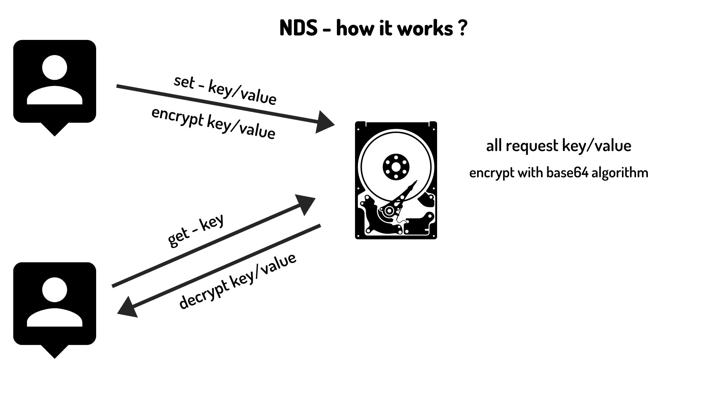

# Node Disk Storage (NDS)

[](https://scrutinizer-ci.com/g/restuwahyu13/node-disk-storage/build-status/main) [](https://coveralls.io/github/restuwahyu13/node-disk-storage?branch=main) [](https://www.codefactor.io/repository/github/restuwahyu13/node-disk-storage) [](https://codebeat.co/projects/github-com-restuwahyu13-node-disk-storage-main) [](https://www.codacy.com/gh/restuwahyu13/node-disk-storage/dashboard?utm_source=github.com&amp;utm_medium=referral&amp;utm_content=restuwahyu13/node-disk-storage&amp;utm_campaign=Badge_Grade)  [](https://github.com/restuwahyu13/node-disk-storage/blob/main/CONTRIBUTING.md)

**node-disk-storage** a simple fast and secure `local storage` for `nodejs`, you can store any data using key and value, and then your data will be **encrypt** to be like this `�+�)data|ZGF0YXxqb2huK2RvZV5eXiQwfDFd^^^$0|1`.



- [Node Disk Storage (NDS)](#node-disk-storage-nds)
  - [Installation](#installation)
  - [API Reference](#api-reference)
  - [Example Usage](#example-usage)
  - [Testing](#testing)
  - [Bugs](#bugs)
  - [Contributing](#contributing)
  - [License](#license)

## Installation

```bash
$ npm install node-disk-storage -S or yarn add node-disk-storage -S
```
## API Reference

- #### Node Disk Storage Options Property

  + **minSize** limit data size, before saving into disk, default value to **1MB**
  + **maxSize** limit data size, before saving into disk, default value to **25MB**

- #### set(key: string, value: any): Promise<boolean | undefined>
  set data using key and value, into disk

- #### get(key: string): Promise<any | undefined>
  get specific data using key, after saving data into disk

- #### remove(key: string): Promise<boolean | undefined>
  remove specific data already exist using key, after saving data into disk

- #### clear(): Promise<boolean | undefined>
  clear all keys exist, after saving data into disk

- #### keys(): Promise<string[] | undefined>
  get all keys exist, after saving data into disk

## Example Usage

- ##### Example Usage Using CommonJs With JavaScript

  ```javascript
   const { NodeDiskStorage } = require('node-disk-storage')

   const nds = new NodeDiskStorage()

   ;(async () => {
     await nds.set("user", {
        id: 1,
        name: 'Leanne Graham',
        username: 'Bret',
        email: 'Sincere@april.biz',
        address: {
          street: 'Kulas Light',
          suite: 'Apt. 556',
          city: 'Gwenborough',
          zipcode: '92998-3874',
          geo: { lat: '-37.3159', lng: '81.1496' }
        },
        phone: '1-770-736-8031 x56442',
        website: 'hildegard.org',
        company: {
          name: 'Romaguera-Crona',
          catchPhrase: 'Multi-layered client-server neural-net',
          bs: 'harness real-time e-markets'
        }
      })
     await nds.get("user")
     await nds.keys()
     await nds.remove("user")
     await nds.clear()
   })()
  ```
- ##### Example Usage Using CommonJs With JavaScript And Options

  ```javascript
   const { NodeDiskStorage } = require('node-disk-storage')

   const nds = new NodeDiskStorage({ minSize: 5, maxSize: 30 })

   ;(async () => {
     await nds.set("user", {
        id: 1,
        name: 'Leanne Graham',
        username: 'Bret',
        email: 'Sincere@april.biz',
        address: {
          street: 'Kulas Light',
          suite: 'Apt. 556',
          city: 'Gwenborough',
          zipcode: '92998-3874',
          geo: { lat: '-37.3159', lng: '81.1496' }
        },
        phone: '1-770-736-8031 x56442',
        website: 'hildegard.org',
        company: {
          name: 'Romaguera-Crona',
          catchPhrase: 'Multi-layered client-server neural-net',
          bs: 'harness real-time e-markets'
        }
      })
     await nds.get("user")
     await nds.keys()
     await nds.remove("user")
     await nds.clear()
  ```

- ##### Example Usage Using ESM With JavaScript

  ```javascript
   import { NodeDiskStorage } from 'node-disk-storage'

   const nds = new NodeDiskStorage()

   ;(async () => {
     await nds.set("user", {
        id: 1,
        name: 'Leanne Graham',
        username: 'Bret',
        email: 'Sincere@april.biz',
        address: {
          street: 'Kulas Light',
          suite: 'Apt. 556',
          city: 'Gwenborough',
          zipcode: '92998-3874',
          geo: { lat: '-37.3159', lng: '81.1496' }
        },
        phone: '1-770-736-8031 x56442',
        website: 'hildegard.org',
        company: {
          name: 'Romaguera-Crona',
          catchPhrase: 'Multi-layered client-server neural-net',
          bs: 'harness real-time e-markets'
        }
      })
     await nds.get("user")
     await nds.keys()
     await nds.remove("user")
     await nds.clear()
  ```

- ##### Example Usage Using ESM With JavaScript And Options

  ```javascript
   import { NodeDiskStorage } from 'node-disk-storage'

   const nds = new NodeDiskStorage({ minSize: 5, maxSize: 30 })

   ;(async () => {
     await nds.set("user", {
        id: 1,
        name: 'Leanne Graham',
        username: 'Bret',
        email: 'Sincere@april.biz',
        address: {
          street: 'Kulas Light',
          suite: 'Apt. 556',
          city: 'Gwenborough',
          zipcode: '92998-3874',
          geo: { lat: '-37.3159', lng: '81.1496' }
        },
        phone: '1-770-736-8031 x56442',
        website: 'hildegard.org',
        company: {
          name: 'Romaguera-Crona',
          catchPhrase: 'Multi-layered client-server neural-net',
          bs: 'harness real-time e-markets'
        }
      })
     await nds.get("user")
     await nds.keys()
     await nds.remove("user")
     await nds.clear()
  ```

## Testing

- Testing Via Local

  ```sh
  npm test or make test
  ```

- Testing Via Local And Build

  ```sh
  make build
  ```

- Testing Via Docker

  ```sh
  docker build -t node-disk-storage or make dkb tag=node-disk-storage
  ```

## Bugs

For information on bugs related to package libraries, please visit [here](https://github.com/restuwahyu13/node-disk-storage/issues)

## Contributing

Want to make **node-disk-storage** more perfect ? Let's contribute and follow the [contribution guide.](https://github.com/restuwahyu13/node-disk-storage/blob/main/CONTRIBUTING.md)

## License

- [MIT License](https://github.com/restuwahyu13/node-disk-storage/blob/main/LICENSE.md)

<p align="right" style="padding: 5px; border-radius: 100%; background-color: red; font-size: 2rem;">
  <b><a href="#node-disk-storage-nds">BACK TO TOP</a></b>
</p>
